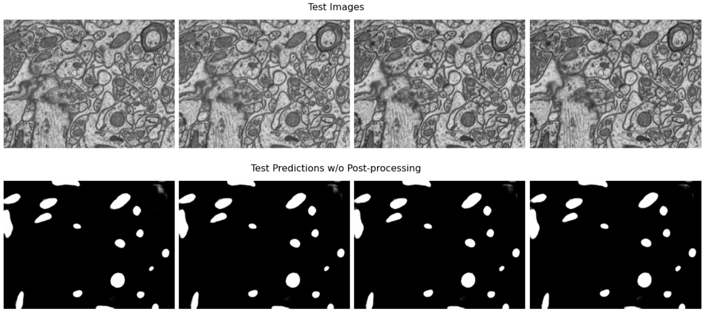

Mitochondria Segmentation
===========================

Introduction
-------------

`Mitochondria <https://en.wikipedia.org/wiki/Mitochondrion>`__ are the primary energy providers for cell activities, thus essential for metabolism.
Quantification of the size and geometry of mitochondria is not only crucial to basic neuroscience research, but also informative to
the clinical studies of several diseases including bipolar disorder and diabetes.

This tutorial has two parts. In the first part, you will learn how to make **pixel-wise class prediction** on the widely used benchmark
dataset released by `Lucchi et al. <https://ieeexplore.ieee.org/document/6619103>`__ in 2012. In the second part, you will learn how to predict the **instance masks** of
individual mitochondrion from the large-scale MitoEM dataset released by `Wei et al. <https://donglaiw.github.io/paper/2020_miccai_mitoEM.pdf>`__ in 2020.

Semantic Segmentation
----------------------

This section provides step-by-step guidance for mitochondria segmentation with the EM benchmark datasets released by `Lucchi et al. (2012) <https://cvlab.epfl.ch/research/page-90578-en-html/research-medical-em-mitochondria-index-php/>`__.
We consider the task as a **semantic segmentation** task and predict the mitochondria pixels with encoder-decoder ConvNets similar to
the models used in affinity prediction in `neuron segmentation <neuron.html>`_. The evaluation of the mitochondria segmentation results is based on the F1 score and Intersection over Union (IoU).

.. note::
    Different from other EM connectomics datasets used in the tutorials, the dataset released by Lucchi et al. is an isotropic dataset,
    which means the spatial resolution along all three axes is the same. Therefore a completely 3D U-Net and data augmentation along z-x
    and z-y planes besides x-y planes are preferred.

All the scripts needed for this tutorial can be found at ``pytorch_connectomics/scripts/``. Need to pass the argument ``--config-file configs/Lucchi-Mitochondria.yaml`` during training and inference to load the required configurations for this task.
The pytorch dataset class of lucchi data is :class:`connectomics.data.dataset.VolumeDataset`.

Qualitative results of the model prediction on the mitochondria segmentation dataset released by
Lucchi et al., without any post-processing.

1 - Get the data
^^^^^^^^^^^^^^^^^^

Download the dataset from our server:

.. code-block:: none

    wget http://rhoana.rc.fas.harvard.edu/dataset/lucchi.zip

For description of the data please check `the author page <https://www.epfl.ch/labs/cvlab/data/data-em/>`_.

2 - Run training
^^^^^^^^^^^^^^^^^^

.. code-block:: none

    source activate py3_torch
    CUDA_VISIBLE_DEVICES=0,1,2,3 python -u -m torch.distributed.run \
    --nproc_per_node=4 --master_port=2345 scripts/main.py --distributed \
    --config-file configs/Lucchi-Mitochondria.yaml

Similar to the `neuron segmentation <neuron.html>`_ tutorial, we use distributed data-parallel training considering its high
efficiency, and also to enable synchronized batch normalization (SyncBN).

3 - Visualize the training progress
^^^^^^^^^^^^^^^^^^^^^^^^^^^^^^^^^^^^^

.. code-block:: none

    tensorboard --logdir outputs/Lucchi_UNet/

4 - Inference on test data
^^^^^^^^^^^^^^^^^^^^^^^^^^^^^^

.. code-block:: none

    source activate py3_torch
    CUDA_VISIBLE_DEVICES=0,1,2,3,4,5,6,7 python -u scripts/main.py \
    --config-file configs/Lucchi-Mitochondria.yaml --inference \
    --checkpoint outputs/Lucchi_UNet/volume_100000.pth.tar

5 - Run evaluation
^^^^^^^^^^^^^^^^^^^^

Since the ground-truth label of the test set is public, we can run the evaluation locally:

.. code-block:: python

    from connectomics.utils.evaluation import get_binary_jaccard
    pred = pred / 255. # output is casted to uint8 with range [0,255].
    gt = (gt!==0).astype(np.uint8)
    thres = [0.4, 0.6, 0.8] # evaluate at multiple thresholds.
    scores = get_binary_jaccard(pred, gt, thres)

The prediction can be further improved by conducting median filtering to remove noise:

.. code-block:: python

    from connectomics.utils.evaluate import get_binary_jaccard
    from connectomics.utils.process import binarize_and_median
    pred = pred / 255. # output is casted to uint8 with range [0,255].
    pred = binarize_and_median(pred, size=(7,7,7), thres=0.8)
    gt = (gt!==0).astype(np.uint8)
    scores = get_binary_jaccard(pred, gt) # prediction is already binarized

Our pretained model achieves a foreground IoU and IoU of **0.892** and **0.943** on the test set, respectively. The results are better or on par with
state-of-the-art approaches. Please check `BENCHMARK.md <https://github.com/zudi-lin/pytorch_connectomics/blob/master/BENCHMARK.md>`_  for detailed performance
comparison and the pre-trained models.

Instance Segmentation
----------------------

This section provides step-by-step guidance for mitochondria segmentation with our benchmark datasets `MitoEM <https://donglaiw.github.io/page/mitoEM/index.html>`_.
We consider the task as 3D **instance segmentation** task and provide three different confiurations of the model output.
The model is ``UNet3D``, similar to the one used in `neuron segmentation <neuron.html>`_.
The evaluation of the segmentation results is based on the AP-75 (average precision with an IoU threshold of 0.75).

.. figure:: ../_static/img/mito_complex.png
    :align: center
    :width: 800px

Complex mitochondria in the MitoEM dataset:(**a**) mitochondria-on-a-string (MOAS), and (**b**) dense tangle of touching instances.
Those challenging cases are prevalent but not covered in previous datasets.

.. note::

    The MitoEM dataset has two sub-datasets **MitoEM-Rat** and **MitoEM-Human** based on the source of the tissues. Three training configuration files on **MitoEM-Rat**
    are provided in ``pytorch_connectomics/configs/MitoEM/`` for different learning setting as described in this `paper <https://donglaiw.github.io/paper/2020_miccai_mitoEM.pdf>`_.

.. tip::

    Since the dataset is very large and can not be directly loaded into memory, we designed the :class:`connectomics.data.dataset.TileDataset` class that only
    loads part of the whole volume each time by opening involved ``PNG`` or ``TIFF`` images.

1 - Dataset introduction
^^^^^^^^^^^^^^^^^^^^^^^^^

The dataset is publicly available at both the `project <https://donglaiw.github.io/page/mitoEM/index.html>`_ page and
the `MitoEM Challenge <https://mitoem.grand-challenge.org/>`_ page. **Dataset description**:

- ``im``: includes 1,000 single-channel ``*.png`` files (**4096x4096**) of raw EM images (with a spatial resolution of **30x8x8** nm).
  The 1,000 images are splited into 400, 100 and 500 slices for training, validation and inference, respectively.

- ``mito_train/``: includes 400 single-channel ``*.png`` files (**4096x4096**) of instance labels for training. Similarly,
  the ``mito_val/`` folder contains 100 slices for validation. The ground-truth annotation of the test set (rest 500 slices)
  is not publicly provided but can be evaluated online at the `MitoEM challenge page <https://mitoem.grand-challenge.org>`_.

To run training, JSON files containing the metadata of the dataset (for both images and labels) need to be provided. Example
JSON files can be found in ``configs/MitoEM``.

2 - Model configuration
^^^^^^^^^^^^^^^^^^^^^^^^^

Configure ``*.yaml`` files for different learning targets:

- ``MitoEM-R-A.yaml``: output 3 channels for predicting the affinty between voxels.

- ``MitoEM-R-AC.yaml``: output 4 channels for predicting both affinity and instance contour.

- ``MitoEM-R-BC.yaml``: output 2 channels for predicting both the binary foreground mask and instance contour. This configuration achieves the
  best overall performance according to our `experiments <https://donglaiw.github.io/paper/2020_miccai_mitoEM.pdf>`_.

3 - Run training
^^^^^^^^^^^^^^^^^^

We show examples for running the training script for the **U3D-BC** model:

.. note::
    By default the path of images and labels are not specified. To
    run the training scripts, please revise the ``DATASET.IMAGE_NAME``, ``DATASET.LABEL_NAME``, ``DATASET.OUTPUT_PATH``
    and ``DATASET.INPUT_PATH`` options in ``configs/MitoEM/MitoEM-R-*.yaml``.
    The options can also be given as command-line arguments without changing of the ``yaml`` configuration files.

.. code-block:: none

    CUDA_VISIBLE_DEVICES=0,1,2,3 python -u -m torch.distributed.run \
    --nproc_per_node=4 --master_port=4321 scripts/main.py --distributed \
    --config-base configs/MitoEM/MitoEM-R-Base.yaml \
    --config-file configs/MitoEM/MitoEM-R-BC.yaml

4 - Visualize the training progress
^^^^^^^^^^^^^^^^^^^^^^^^^^^^^^^^^^^^^

We use TensorBoard to visualize the training progress. For Harvard FASRC cluter users, more
info can be found `here <https://vcg.github.io/newbie-wiki/build/html/computation/machine_rc.html>`_.

.. code-block:: none

    tensorboard --logdir outputs/MitoEM_R_BC/

5 - Run inference
^^^^^^^^^^^^^^^^^^^

Run inference on validation/test image volumes (suppose the model is optimized for 100k iterations):

.. code-block:: none

    python -u scripts/main.py \
    --config-base configs/MitoEM/MitoEM-R-Base.yaml \
    --config-file configs/MitoEM/MitoEM-R-BC.yaml --inference \
    --checkpoint outputs/MitoEM_R_BC/checkpoint_100000.pth.tar

.. note::
    Please change the ``INFERENCE.IMAGE_NAME`` ``INFERENCE.OUTPUT_PATH`` ``INFERENCE.OUTPUT_NAME``
    options in ``configs/MitoEM-R-*.yaml`` based on your own data path.

6 - Post-process
^^^^^^^^^^^^^^^^^

The post-processing step requires merging output volumes and applying watershed segmentation.
As mentioned before, the dataset is very large and can hardly be directly loaded into memory for
processing. Therefore our code run prediction on smaller chunks sequentially, which produces
multiple ``*.h5`` files with the coordinate information. To merge the chunks into a single volume
and apply the segmentation algorithm:

.. code-block:: python

    import glob
    import numpy as np
    from connectomics.data.utils import readvol
    from connectomics.utils.process import bc_watershed

    output_files = 'outputs/MitoEM_R_BC/test/*.h5' # output folder with chunks
    chunks = glob.glob(output_files)

    vol_shape = (2, 500, 4096, 4096) # MitoEM test set
    # vol_shape = (2, 100, 4096, 4096) # MitoEM validation set
    pred = np.ones(vol_shape, dtype=np.uint8)
    for x in chunks:
        pos = x.strip().split("/")[-1]
        print("process chunk: ", pos)
        pos = pos.split("_")[1].split("-")
        pos = list(map(int, pos))
        chunk = readvol(x)
        pred[:, pos[0]:pos[1], pos[2]:pos[3], pos[4]:pos[5]] = chunk

    # This function process the array in numpy.float64 format.
    # Please allocate enough memory for processing.
    segm = bc_watershed(pred, thres1=0.85, thres2=0.6, thres3=0.8, thres_small=1024)

.. note::

    The decoding parameters for the watershed step are a set of reasonable thresholds but not optimal given different 
    segmentation models. We suggest conducting a hyper-parameter search on the validation set to decide the decoding parameters.   

Then the segmentation map should be ready to be submitted to the `MitoEM <https://mitoem.grand-challenge.org/>`_ challenge website for
evaluation. Please note that this tutorial only take the **MitoEM-Rat** set as an example. The
**MitoEM-Human** set also need to be segmented for online evaluation.

7 - Evaluate on the validation set
^^^^^^^^^^^^^^^^^^^^^^^^^^^^^^^^^^^

The performance of the MitoEM test sets can only be evaluated on the challenge website. Dataset users are encouraged to experiment 
with the metric code on the validation set to understand the evaluation function and conduct a hyper-parameter search. 
Evaluation is performed with the ``demo.py`` file provided by the `mAP_3Dvolume <https://github.com/ygCoconut/mAP_3Dvolume/tree/grand-challenge>`__ repository. 
The ground truth ``.h5`` file can be generated from the 2D images using the following script:

.. code-block:: python

  import glob
  import numpy as np
  from connectomics.data.utils import writeh5, readvol

  gt_path = "datasets/MitoEM_R/mito_val/*.tif"
  files = sorted(glob.glob(gt_path))
  
  data = []
  for i, file in enumerate(files):
      print("process chunk: ", i)
      data.append(readvol(file))

  data = np.array(data)
  writeh5("validation_gt.h5", data)

The resulting scores can then be obtained by executing ``python demo.py -gt /path/to/validation_gt.h5 -p /path/to/segmentation_result.h5``
