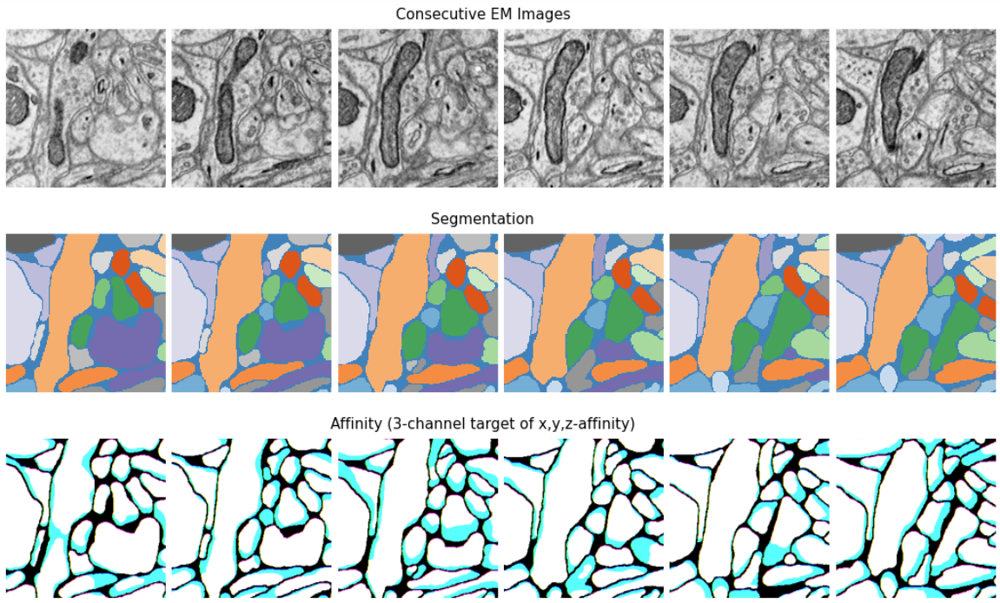

Neuron Segmentation
=====================

This tutorial provides step-by-step guidance for neuron segmentation with SENMI3D benchmark datasets.
Dense neuron segmentation in electronic microscopy (EM) images belongs to the category of **instance segmentation**.
The methodology is to first predict the affinity map (the connectivity of each pixel to neighboring pixels) 
with an encoder-decoder ConvNets and then generate the segmentation map using a standard
segmentation algorithm (e.g., watershed).

The evaluation of segmentation results is based on the `Rand Index <https://en.wikipedia.org/wiki/Rand_index>`_
and `Variation of Information <https://en.wikipedia.org/wiki/Variation_of_information>`_.

.. note::
    Before running neuron segmentation, please take a look at the `demos <https://github.com/zudi-lin/pytorch_connectomics/tree/master/demos>`_
    to get familiar with the datasets and available utility functions in this package.

The main script to run the training and inference is ``pytorch_connectomics/scripts/main.py``. 
The pytorch target affinity generation is :class:`connectomics.data.dataset.VolumeDataset`.

    Examples of EM images, segmentation and affinity map from the SNEMI3D dataset. Since the 
    affinity map has 3 channels, we can visualize them as RGB images.

#. Get the dataset:

    .. code-block:: none

        wget http://rhoana.rc.fas.harvard.edu/dataset/snemi.zip

    For description of the data please check `this page <https://vcg.github.io/newbie-wiki/build/html/data/data_em.html>`_.

    .. note::
        The affinity value of a pixel (voxel) can be 1 even at the segment boundary. Thus we usually widen the instance border (erode the 
        instance mask) to let the model make more conservative predictions to prevent merge error.

#. Provide the ``yaml`` configuration file to run training:

    .. code-block:: none

        $ source activate py3_torch
        $ python scripts/main.py --config-file configs/SNEMI-Neuron.yaml

    The configuration file for training is in ``configs/SNEMI-Neuron.yaml``. 
    We usually create a ``datasets/`` folder under ``pytorch_connectomics`` and put the SNEMI dataset there. 
    Please modify the following options according to
    your system configuration and data storage:
 
    - ``IMAGE_NAME``: Name of the volume file (HDF5 or TIFF).
    - ``LABEL_NAME``: Name of the label file (HDF5 or TIFF).
    - ``INPUT_PATH``: Path to both input files above.
    - ``OUTPUT_PATH``: Path to store outputs (checkpoints and Tensorboard events).
    - ``NUM_GPUS``: Number of GPUs to use.
    - ``NUM_CPUS``: Number of CPU cores to use (for data loading).

#. (*Optional*) To run training starting from pretrained weights, add a checkpoint file:

    .. code-block:: none

        $ source activate py3_torch
        $ python scripts/main.py --config-file configs/SNEMI-Neuron.yaml \
        $ --checkpoint /path/to/checkpoint/checkpoint_xxxxx.pth.tar

#. Visualize the training progress:

    .. code-block:: none

        $ tensorboard --logdir outputs/SNEMI3D/
                                                                              
#. Run inference on image volumes (add ``--inference``). During inference the model can use larger batch sizes or take bigger inputs. Test-time augmentation is also applied by default:

    .. code-block:: none

        $ python scripts/main.py --config-file configs/SNEMI-Neuron.yaml 
        --inference --checkpoint outputs/SNEMI3D/checkpoint_xxxxx.pth

#. Generate segmentation and run evaluation:

    #. Download the ``waterz`` package:

        .. code-block:: none

            $ git clone git@github.com:zudi-lin/waterz.git
            $ cd waterz
            $ pip install --editable .

    #. Download the ``zwatershed`` package:

        .. code-block:: none

            $ git clone git@github.com:zudi-lin/zwatershed.git
            $ cd zwatershed
            $ pip install --editable .

    #. Generate 3D segmentation and report Rand and VI score using ``waterz``. Please see examples at `https://github.com/zudi-lin/waterz <https://github.com/zudi-lin/waterz>`_.
