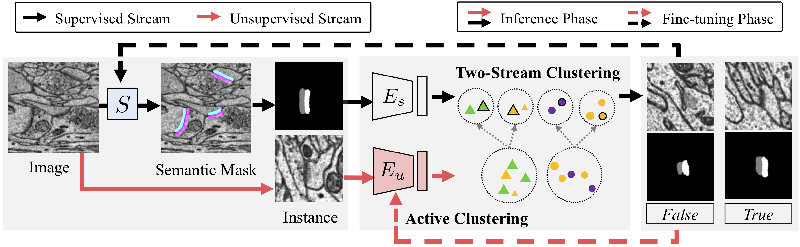

## Two-Stream Active Query Suggestion for Active Learning in Connectomics

[[Paper](https://www.ecva.net/papers/eccv_2020/papers_ECCV/papers/123630103.pdf)] [[Supplement](https://www.ecva.net/papers/eccv_2020/papers_ECCV/papers/123630103-supp.pdf)]

### Abstract

For large-scale vision tasks in biomedical images, the labeled data is often limited to train effective deep models. Active learning is a common solution, where a query suggestion method selects representative unlabeled samples for annotation, and the new labels are used to improve the base model. However, most query suggestion models optimize their learnable parameters only on the limited labeled data and consequently become less effective for the more challenging unlabeled data. To tackle this, we propose a two-stream active query suggestion approach. In addition to the supervised feature extractor, we introduce an unsupervised one optimized on all raw images to capture diverse image features, which can later be improved by fine-tuning on new labels. As a use case, we build an end-to-end active learning framework with our query suggestion method for 3D synapse detection and mitochondria segmentation in connectomics. With the framework, we curate, to our best knowledge, the largest connectomics dataset with dense synapses and mitochondria annotation.



### Unique Configurations

We show below the list of configurations exclusive for the two-stream query suggestion workflow, which extends the basic configurations in PyTorch Connectomics.

```yaml
TWOSTREAM:
  IMAGE_VAE: True # train/predict using image VAE
  LABEL_TYPE: syn # label type for mask VAE
  LATENT_DIM: # VAE latent dimension
  HIDDEN_DIMS: [32, 64, 128, 256, 256, 512]
  WIDTH: 128 # width of the input square patches
  KLD_WEIGHT: 1e-4 # weight of the KL divergence
```

### Code

The two-stream query suggestion framework consists of three steps, including training the base segmentation/detection models, optimizing variational autoencoders (VAEs) for feature extraction, and hierarchical clustering for query suggestion. This project folder is mainly for feature extraction using VAEs. Other related code is listed below:

- Synaptic cleft detection on the CREMI dataset [[link](https://connectomics.readthedocs.io/en/latest/tutorials/synapse.html#synaptic-cleft-detection)]
- Synaptic polarity detection on the EM-R50 dataset [[link](https://connectomics.readthedocs.io/en/latest/tutorials/synapse.html#synaptic-polarity-detection)]
- Mitocondria segmentation on the Lucchi dataset [[link](https://connectomics.readthedocs.io/en/latest/tutorials/mito.html#semantic-segmentation)]
- Two-stream query suggestion algorithm [[link](./two_stream.py)]

### Citation

This paper is published at the 16th European Conference on Computer Vision (**ECCV 2020**).

```bibtex
@inproceedings{lin2020two,
  title={Two stream active query suggestion for active learning in connectomics},
  author={Lin, Zudi and Wei, Donglai and Jang, Won-Dong and Zhou, Siyan and Chen, Xupeng and Wang, Xueying and Schalek, Richard and Berger, Daniel and Matejek, Brian and Kamentsky, Lee and others},
  booktitle={European Conference on Computer Vision},
  pages={103--120},
  year={2020},
  organization={Springer}
}
```

### Acknowledgements

This project has been partially supported by NSF award IIS-1835231 and NIH award 5U54CA225088-03.


